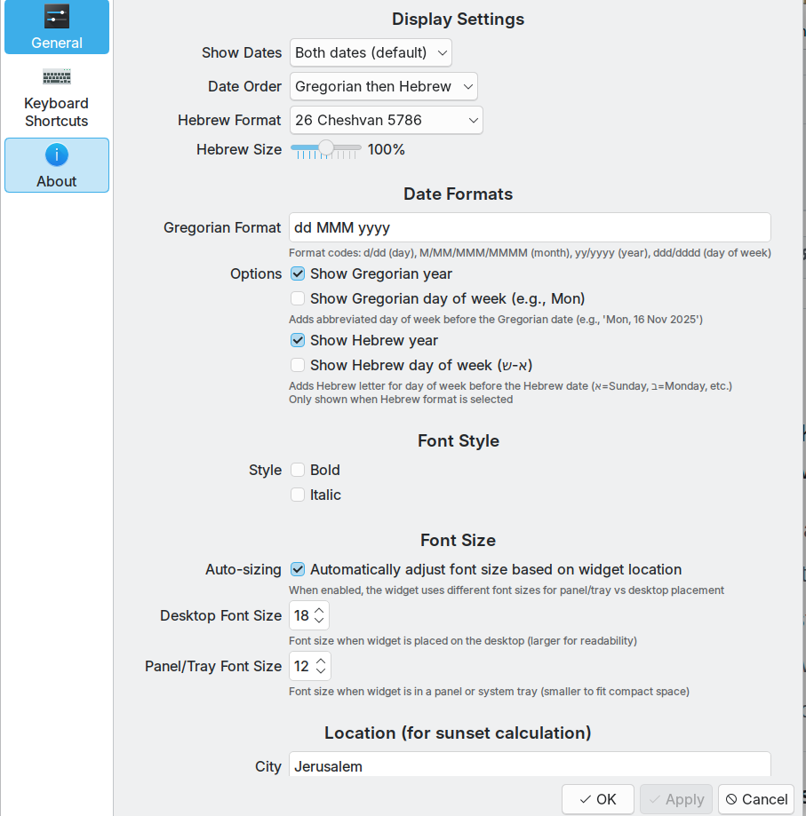
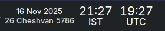
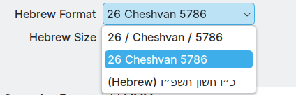

# Hebrew Date KDE Plasma 6 Widget

[](https://github.com/danielrosehill/Hebrew-Date-KDE-Widget)
[](https://www.opencode.net/danielrosehill/hebrew-date-plasmoid)
[](https://opensource.org/licenses/MIT)



A KDE Plasma 6 widget that displays both Gregorian and Hebrew calendar dates in your system tray or on your desktop. Perfect for keeping track of both calendars at a glance with automatic sunset-aware date transitions.

## Screenshots

<div align="center">
  
  
  
  
</div>

## Features

### Display Modes
- **Dual Date Display**: Shows both Gregorian and Hebrew dates on separate lines
- **Single Date Mode**: Display Hebrew only or Gregorian only
- **Flexible Ordering**: Choose which date appears first

### Hebrew Date Formats
- `26 / Cheshvan / 5786` (with slashes)
- `26 Cheshvan 5786` (simple format)
- `כ״ו חשון תשפ״ו` (Hebrew characters with gershayim)

### Adaptive Font Sizing
- **Context-Aware**: Automatically adjusts font size based on placement
  - Larger fonts (default 18pt) when placed on desktop
  - Smaller fonts (default 11pt) when in panel/system tray
- **User Override**: Manually configure font sizes for both contexts
- **Auto-Sizing Toggle**: Enable/disable automatic size adjustment

### Customization Options
- **Date Order**: Gregorian first or Hebrew first
- **Size Ratio**: Adjust Hebrew date size (50-150% of Gregorian size)
- **Year Display**: Show/hide year for either calendar
- **Font Styling**: Bold and italic options
- **Gregorian Format**: Fully customizable using Qt date format codes

### Smart Date Handling
- **Location-Aware**: Accounts for sunset (shkiah) when calculating Hebrew date transitions
- **Accurate Timing**: Uses Hebcal API with your coordinates for precise sunset calculation
- **Efficient Polling**: Smart update scheduling instead of constant polling
  - Updates at midnight (new Gregorian day)
  - Updates 30 seconds after sunset (new Hebrew day)
  - Checks every 4 hours if sunset time unknown
  - Instant update on location changes
- **Minimal Resource Usage**: Caches sunset time in lightweight persistent storage
- **Offline Cache**: Displays last known date if API is temporarily unavailable

## Installation

### Quick Install

```bash
./install.sh
```

### Manual Installation

```bash
kpackagetool6 --type Plasma/Applet --install package
```

To upgrade after making changes:
```bash
kpackagetool6 --type Plasma/Applet --upgrade package
```

To remove:
```bash
kpackagetool6 --type Plasma/Applet --remove com.danielrosehill.hebrewdate
```

After installation, restart plasmashell:
```bash
kquitapp6 plasmashell && kstart plasmashell
```

## Adding to Your Panel

1. Right-click on your panel or desktop
2. Select "Add Widgets"
3. Search for "Hebrew Date Widget"
4. Drag it to your system tray or panel

## Configuration

Right-click the widget and select "Configure" to access settings:

### Display Settings
- **Date Order**: Choose whether Gregorian or Hebrew date appears first
- **Hebrew Format**: Select from 3 format options
- **Hebrew Size**: Adjust the relative size of the Hebrew date (50-150%)

### Date Formats
- **Gregorian Format**: Customize using Qt date format codes:
  - `d`/`dd` - day as number (1-31 or 01-31)
  - `M`/`MM`/`MMM`/`MMMM` - month (1, 01, Jan, January)
  - `yy`/`yyyy` - year (00-99 or 0000-9999)
  - `dddd` - day of week (Monday-Sunday)
- **Show Gregorian Year**: Toggle year display for Gregorian date
- **Show Hebrew Year**: Toggle year display for Hebrew date

### Font Style
- Bold
- Italic

### Font Size
- **Auto-sizing**: Enable automatic font adjustment based on widget location
- **Desktop Font Size**: Configure font size for desktop placement (8-72pt)
- **Panel/Tray Font Size**: Configure font size for panel/tray placement (6-36pt)

### Location Settings
Configure your location for accurate sunset-based date transitions:
- **City**: Your city name (for reference)
- **Latitude**: Your latitude (e.g., 31.7683 for Jerusalem)
- **Longitude**: Your longitude (e.g., 35.2137 for Jerusalem)

**Important**: The Hebrew calendar day begins at sundown (shkiah). The widget uses your location to determine the exact transition time.

## How It Works

The widget uses the [Hebcal API](https://www.hebcal.com) to:
1. Convert Gregorian dates to Hebrew calendar dates
2. Determine sunset times based on your location
3. Automatically switch to the next Hebrew date after sundown

### Efficient Update Strategy

Instead of polling every minute, the widget uses intelligent scheduling:

1. **On First Load**: Fetches current date and sunset time from API
2. **Sunset Time Caching**: Stores today's sunset time in persistent settings
3. **Strategic Updates**:
   - **Before Sunset**: Schedules next update 30 seconds after sunset
   - **After Sunset**: Schedules next update at midnight
   - **No Cached Time**: Checks every 4 hours
4. **Location Changes**: Instantly clears cache and updates

This approach minimizes API calls and system resource usage while maintaining accuracy.

## Technical Details

- **Platform**: KDE Plasma 6
- **API**: Hebcal Converter API
- **Update Strategy**: Smart polling (midnight + sunset transitions)
- **Cache**: Persistent storage for dates and sunset times
- **Fallback**: Displays cached date if API is unavailable
- **Languages**: Supports both English transliteration and Hebrew characters
- **Resource Usage**: Minimal - only 2-3 API calls per day typical

## Example Display

Depending on your configuration, the widget can display dates like:

```
Sunday 16 November 2025
26 Cheshvan 5786
```

or

```
כ״ו חשון תשפ״ו
16 November 2025
```

## Requirements

- KDE Plasma 6
- `kpackagetool6`
- Internet connection (for Hebcal API)
- Qt 6.x

## Troubleshooting

**Widget doesn't appear after installation**
- Restart plasmashell: `kquitapp6 plasmashell && kstart plasmashell`

**Hebrew date shows "unavailable"**
- Check internet connection
- Verify location settings (latitude/longitude)
- Widget will use cached date if API is temporarily unavailable

**Date doesn't update at sunset**
- Verify your latitude/longitude are correct
- Check console logs (run `journalctl -f` to see widget debug output)
- Widget should update within 30 seconds after sunset
- Try clearing the cache by changing your location and changing it back

## Development

### Creation
Based on the [Date Only Widget](https://store.kde.org/p/2303033) for KDE Plasma

### Development Process
- **Primary Tool**: Claude Code
- **Methodology**: Human-in-the-loop development
- **Developer**: Daniel Rosehill

### Validation
Tested and validated on:
- **OS**: Ubuntu 25.10
- **Desktop**: KDE Plasma 6 (Wayland)

## Author

Built by Claude Code based upon [Date Only](https://store.kde.org/p/2303033). 

Prompting/HITL:

**Daniel Rosehill** 
- Website: [danielrosehill.com](https://danielrosehill.com)
- Email: public@danielrosehill.com
- GitHub: [github.com/danielrosehill](https://github.com/danielrosehill) 
